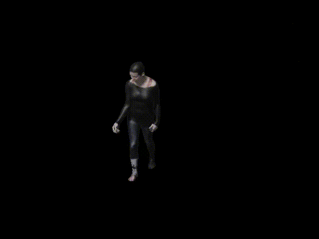

# PG-engine (pose generator engine)
The engine to generate human pose dataset based on blender.(blender2.92 or higher).  Committed to  more reality human render engine. Welcom joining this project and develop it.



## Installation

Installation process in linux os, and for other other os, blender add-on is avaliable, or you can modify installation process for your os.

1. blender installation

   - Download blender in [offical website](https://download.blender.org/release/) (blender2.92 or higher)
   - Extract blender file into your path
   - Download the get-pip.py and install  for blender env pip install 

   ```shell
   wget https://bootstrap.pypa.io/get-pip.py
   blender-2.92.0-linux64/2.92/python/bin/python3.7m get-pip.py
   # new you can pip install some package
   blender-2.92.0-linux64/2.92/python/bin/pip install scipy
   blender-2.92.0-linux64/2.92/python/bin/pip install joblib
   blender-2.92.0-linux64/2.92/python/bin/pip install pyyaml
   blender-2.92.0-linux64/2.92/python/bin/pip install tqdm
   ```

2. install some package with anaconda

   ```shell
   conda create -n blender-env python=3.7
   conda activate blender-env
   conda install -c conda-forge openexr-python
   conda install -c conda-forge ffmpeg
   conda install scipy
   pip install chumpy
   # copy the conda env package into blender path
   cp -r ${CONDA_PREFIX}/lib/python3.7/site-packages/OpenEXR* blender-2.92.0-linux64/2.92/python/lib/python3.7/site-packages/
   cp ${CONDA_PREFIX}/lib/*.so* blender-2.92.0-linux64/2.92/python/lib/
   cp ${CONDA_PREFIX}/bin/ff* blender-2.92.0-linux64/2.92/python/bin
   #
   ```

3. Download some necessary  data:

## [Document](doc.md)

## Framework

### 1.ENGINE
- [x] Scene : Init the overall scene of blender and input into Render to render source.
- [x] Material : Self-defined shading of blender(osl) to process: (**need to develop it for more reality pose**)
    -  Textures of 3D model
    -  Lights of scene
    -  Other material opertaion.
- [x] Render : Using blender engine to render animation.
- [x] Model : The object and animation engine.
  - [x] SMPL
  - [x] SMPL-X
  - [ ] Self-designed model

### 2.INPUT
- bg figures: the background  of scene  
- uv textures : 3D model's textures
- lights: the scene's lights
- camera: multi-view or single-view camera parameters
- pose ( +shape) data. : antimation input data.

### 3.OUTPUT
- [x] video: .mp4
- [x] images 
- [x] labels


