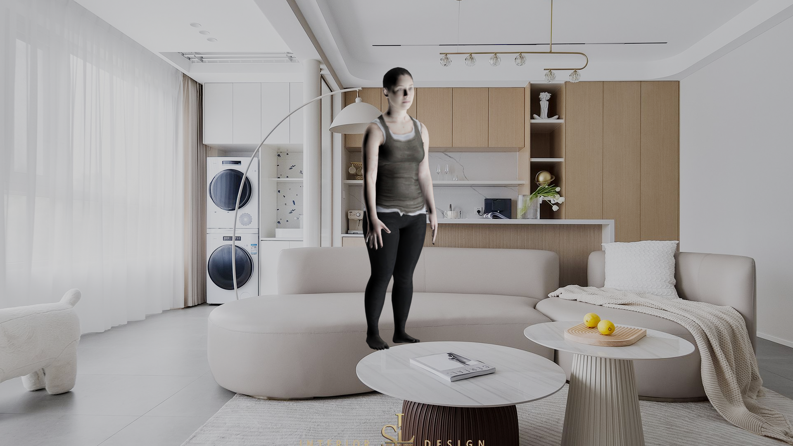
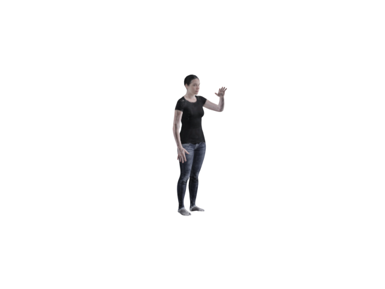
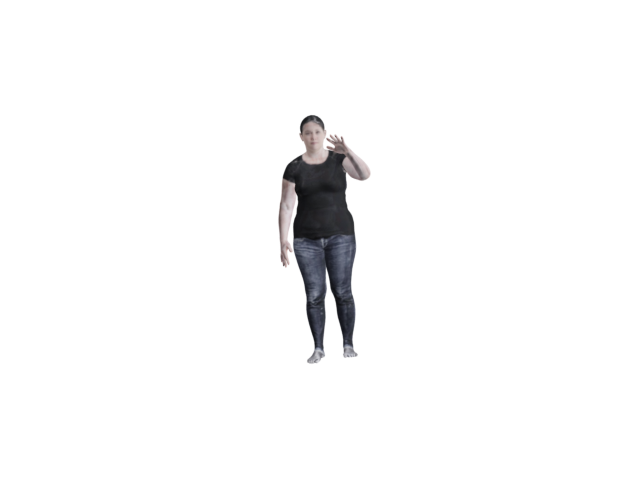
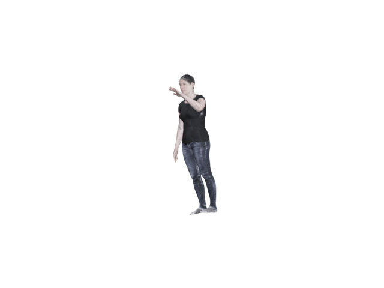
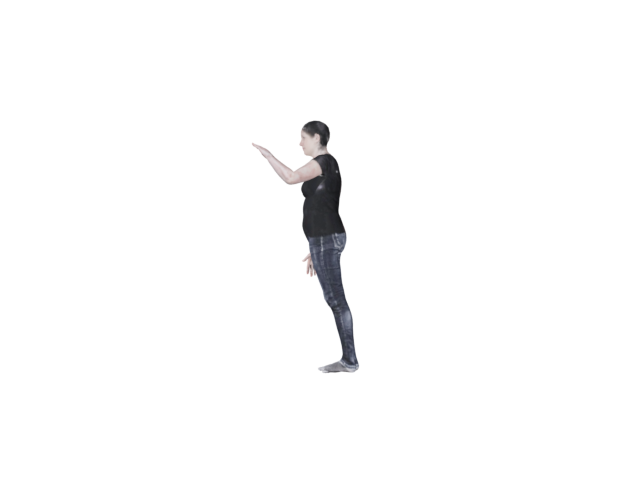
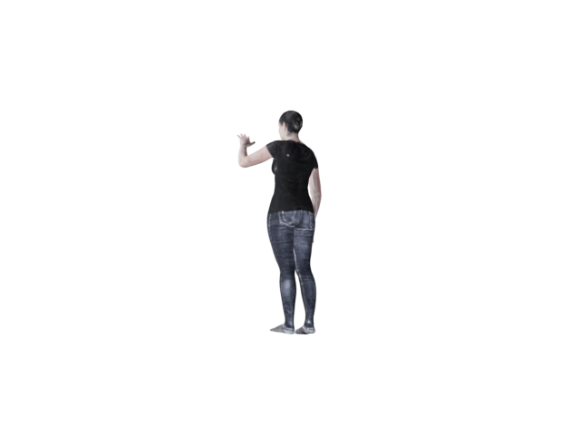
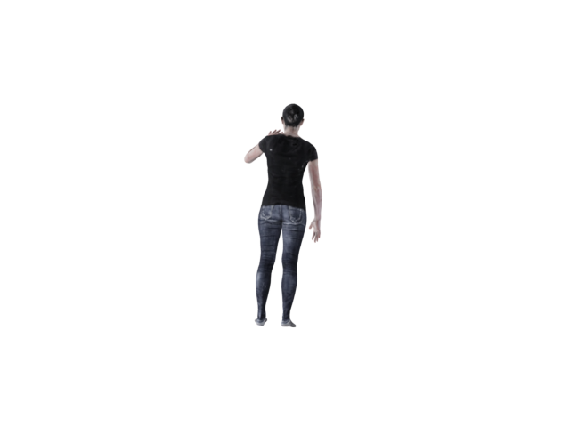
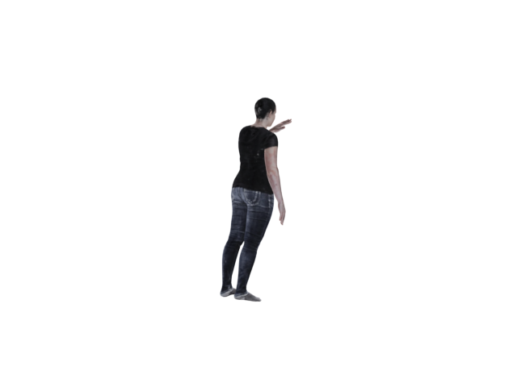

<!--
 * @Author: cvhades
 * @Date: 2021-11-09 16:15:16
 * @LastEditTime: 2021-11-26 15:54:25
 * @LastEditors: Please set LastEditors
 * @FilePath: /PG-engine/README.md
-->

# PG-engine (pose generator engine)
The engine to generate human pose dataset based on blender.(blender2.92).  Committed to  more reality human render engine. Welcom join this project and develop it.


# demo
## SINGLE-VIEW



## MULTI-VIEW


|angle| image|
|:----:|:----:|
|$0^o$ ||
|$45^o$||
|$90^o$||
|$135^o$||
|$180^o$||
|$225^o$||
|$270^o$||
|$315^o$||
## Framework

### 1.ENGINE
- [x] Scene : Init the overall scene of blender and input into Render to render source.
- [x] Material : Self-defined shading of blender(osl) to process: (**need to develop it for more reality pose**)
    -  Textures of 3D model
    -  Lights of scene
    -  Other material opertaion.
- [x] Render : Using blender engine to render source.
- [x] Model : The object and animation engine.
  - [x] SMPL
  - [ ] SMPL-X
  - [ ] Self-designed model

### 2.INPUT
- bg figures: the background  of scene  
- uv textures : 3D model's textures
- lights: the scene's lights
- camera: multi-view or single-view camera parameters
- pose ( +shape) data. : antimation input data.

### 3.OUTPUT
- [x] video: .mp4
- [x] images 
- [x] labels


## Some detail

### camera 
```
Euler "XYZ":[yaw,pitch,roll]

X->r
Y->p
Z->y
```